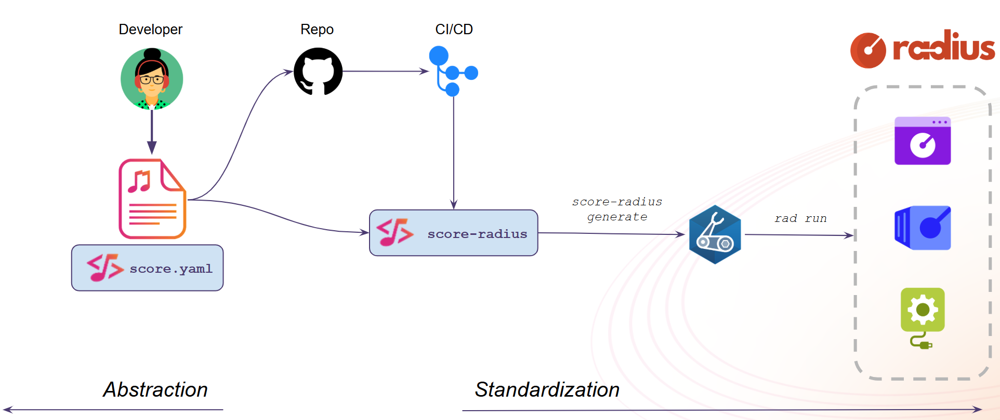

# score-radius

---

:warning: Experimental Notice :warning:

Unlike the official Score implementations [score-compose](https://github.com/score-spec/score-compose) and [score-k8s](https://github.com/score-spec/score-k8s), `score-radius` is still in an experimental status. If you're interested in improving the `score-radius` implementation, we'd love to support you! Please reach out to us for assistance and collaboration.

---

`score-radius` is a Score implementation of the [Score specification](https://score.dev/) for [Radius](https://radapp.io/).



- [Installation](./docs/installation.md)
- [CLI](./docs/cli.md)
- [Quickstart](./docs/quickstart.md)
- [Demo](./docs/demo.md)
  - Live demo delivered during the [Radius Community Call – 2025/12/09](https://youtu.be/XJorwBWmWCI?list=PLrZ6kld_pvgwYMLI-j_f0Dq2Dgv5MlK8R&t=1753)

```bash
score-radius init

score-radius generate score.yaml -o app.bicep

rad run app.bicep --group default --application quickstart --environment default
```
