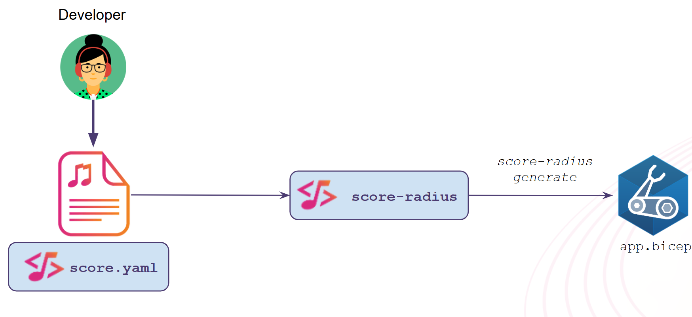
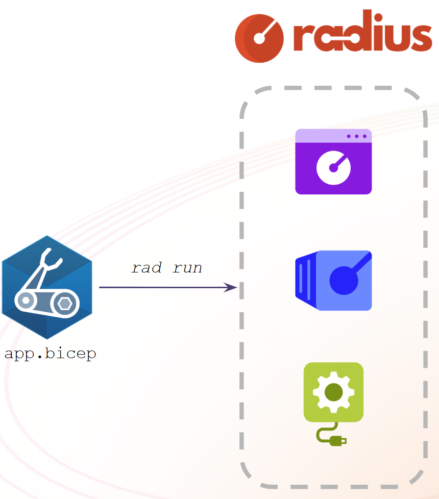

## Define a simple Workload with Score file

```yaml
apiVersion: score.dev/v1b1
metadata:
  name: podinfo
containers:
  podinfo:
    image: .
```

## Generate the Radius file from the Score file



```bash
score-radius init

score-radius generate score.yaml \
    -i ghcr.io/stefanprodan/podinfo:latest \
    -o app.bicep
```

## Deploy the Radius file



```bash
rad run app.bicep --group default --application podinfo --environment default
```

```bash
rad app graph -a podinfo
```

## Expose the Workload via a Service

```yaml
apiVersion: score.dev/v1b1
metadata:
  name: podinfo
containers:
  podinfo:
    image: .
service:
  ports:
    http:
      port: 9898
      targetPort: 9898
```

```bash
score-radius generate score.yaml \
    -i ghcr.io/stefanprodan/podinfo:latest \
    -o app.bicep
```

```bash
rad run app.bicep --group default --application podinfo --environment default
```

```bash
rad app graph -a podinfo
```

## Use a Redis database

```bash
score-radius init --provisioners https://raw.githubusercontent.com/score-spec/score-radius/refs/heads/main/examples/provisioners/redis.provisioners.yaml

score-radius provisioners list
```

```yaml
apiVersion: score.dev/v1b1
metadata:
  name: podinfo
containers:
  podinfo:
    image: .
    command:
      - ./podinfo
    args:
      - --port=9898
      - --cache-server=tcp://$(CONNECTION_REDIS_HOST):$(CONNECTION_REDIS_PORT)
    variables:
      PODINFO_UI_COLOR: "#567c34ff"
      PODINFO_UI_MESSAGE: "Podinfo with Redis!"
      CONNECTION_REDIS_HOST: ${resources.cache.host}
      CONNECTION_REDIS_PORT: ${resources.cache.port}
    livenessProbe:
      httpGet:
        port: 9898
        path: /healthz
    readinessProbe:
      httpGet:
        port: 9898
        path: /readyz
service:
  ports:
    http:
      port: 9898
      targetPort: 9898
      protocol: TCP
resources:
  cache:
    type: redis
    params:
      disableDefaultEnvVars: true
```

```bash
score-radius generate score.yaml \
    -i ghcr.io/stefanprodan/podinfo:latest \
    -o app.bicep
```

```bash
rad run app.bicep --group default --application podinfo --environment default
```

```bash
rad app graph -a podinfo
```

## Deploy the same Workload Score file locally with Docker Compose

```bash
score-compose init --no-sample

score-compose generate score.yaml \
    --image ghcr.io/stefanprodan/podinfo:latest \
    --publish 9898:podinfo:9898 \
    -o compose.yaml
```

```bash
docker compose up -d --wait
```

## Wrap up, why `score-radius`?

- Simplification of the Workload authoring part (YAML and not Radius/Bicep)
- Add the Developer inner loop deployment, with `score-compose` and Docker Compose


## Cleanup

```bash
docker compose down

rad app delete podinfo

cd ..
rm -rf podinfo/.score-compose
rm -rf podinfo/.score-radius
rm podinfo/compose.yaml

#make build
cd podinfo
alias score-radius=../score-radius
kubectl get pods -n radius-system
rad app list
```