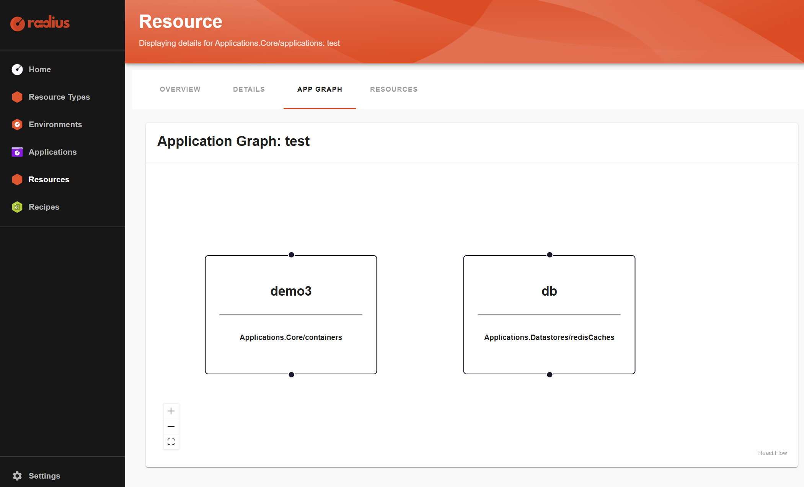

# Quickstart

TOC:
- [Prerequisites](#prerequisites)
- [As Platform Engineer, set up Kind cluster with Radius](#as-platform-engineer-set-up-kind-cluster-with-radius)
- [As Developer, describe your Workload with a Score file](#as-developer-describe-your-workload-with-a-score-file)
- [In CI/CD, generate Radius's app.bicep from Score](#in-cicd-generate-radiuss-appbicep-from-score)
- [In CI/CD, deploy the generated Radius's app.bicep to Radius](#in-cicd-deploy-the-generated-radiuss-appbicep-to-radius)
- [See the application in the Radius dashboard](#see-the-application-in-the-radius-dashboard)
- [As Developer, deploy my Workload locally with Docker Compose](#as-developer-deploy-my-workload-locally-with-docker-compose)

## Prerequisites

- Have Docker installed and running locally
- Have `kind` CLi installed locally
- Have `rad` CLi installed locally
- Have `score-radius` CLI installed locally, see options [here](./installation.md).

## As Platform Engineer, set up Kind cluster with Radius

```bash
./scripts/setup-kind-cluster.sh
```

```bash
rad workspace create kubernetes default
rad group create default --workspace default
rad env create default --group default
rad recipe register default --environment default --resource-type "Applications.Datastores/redisCaches" --template-kind bicep --template-path "ghcr.io/radius-project/recipes/local-dev/rediscaches:latest"
```

## As Developer, describe your Workload with a Score file

First, create a dedicated folder where you will have all the files needed to successfully deploy your application to Radius:
```bash
mkdir podinfo
cd podinfo
```

Create a `score.yaml` with this content:
```yaml
apiVersion: score.dev/v1b1
metadata:
  name: podinfo
containers:
  podinfo:
    image: .
    command:
      - ./podinfo
    args:
      - --port=9898
      - --cache-server=tcp://$(CONNECTION_REDIS_HOST):$(CONNECTION_REDIS_PORT)
    variables:
      PODINFO_UI_COLOR: "#34577c"
      PODINFO_UI_MESSAGE: ""
      CONNECTION_REDIS_HOST: ${resources.cache.host}
      CONNECTION_REDIS_PORT: ${resources.cache.port}
    livenessProbe:
      httpGet:
        port: 9898
        path: /healthz
    readinessProbe:
      httpGet:
        port: 9898
        path: /readyz
service:
  ports:
    http:
      port: 9898
      targetPort: 9898
      protocol: TCP
resources:
  cache:
    type: redis
    params:
      disableDefaultEnvVars: true
```

At this stage, here are the files you have locally:
```none
.
└──score.yaml
```

## In CI/CD, generate Radius's app.bicep from Score

Initialize the current `score-radius` workspace:
```bash
score-radius init --no-sample --provisioners ../examples/provisioners/redis.provisioners.yaml
```

See the available resource types:
```bash
score-radius provisioners list
```

```none
+-------+---------+-----------------------+--------------------------------------------------+----------------------------------------------------------------+
| TYPE  |  CLASS  |        PARAMS         |                     OUTPUTS                      |                          DESCRIPTION                           |
+-------+---------+-----------------------+--------------------------------------------------+----------------------------------------------------------------+
| redis | default | disableDefaultEnvVars | connectionString, host, password, port, username | Generates a Applications.Datastores/redisCaches bicep resource |
+-------+---------+-----------------------+--------------------------------------------------+----------------------------------------------------------------+
```

Generate the Radius's `app.bicep` file from the Score file:
```bash
score-radius generate score.yaml \
    -i ghcr.io/stefanprodan/podinfo:latest \
    -o app.bicep
```

At this stage, here are the files you have locally:
```none
.
├── app.bicep
├── .score-radius
│   ├── redis.provisioners.yaml
│   └── state.yaml
└── score.yaml
```

## In CI/CD, deploy the generated Radius's app.bicep to Radius

Create a `bicepconfig.json`:
```json
{
	"experimentalFeaturesEnabled": {
		"extensibility": true
	},
	"extensions": {
		"radius": "br:biceptypes.azurecr.io/radius:latest"
	}
}
```

At this stage, here are the files you have locally:
```none
.
├── app.bicep
├── bicepconfig.json
├── .score-radius
│   ├── redis.provisioners.yaml
│   └── state.yaml
└── score.yaml
```

```bash
rad run app.bicep --group default --application podinfo --environment default
```

Or:
```bash
rad deploy app.bicep --group default --application podinfo --environment default

kubectl port-forward FIXME
```

## See the application in the Radius dashboard



Run this command line too:
```bash
rad app graph -a podinfo
```

```none
Displaying application: podinfo

Name: podinfo (Applications.Core/containers)
Connections:
  podinfo -> cache (Applications.Datastores/redisCaches)
Resources:
  podinfo (apps/Deployment)
  podinfo (core/Secret)
  podinfo (core/Service)
  podinfo (core/ServiceAccount)
  podinfo (rbac.authorization.k8s.io/Role)
  podinfo (rbac.authorization.k8s.io/RoleBinding)

Name: cache (Applications.Datastores/redisCaches)
Connections:
  podinfo (Applications.Core/containers) -> cache
Resources:
  redis-cnibclsbkpmss (apps/Deployment)
  redis-cnibclsbkpmss (core/Service)
```

## As Developer, deploy my Workload locally with Docker Compose

Install `score-compose`, see options [here](https://docs.score.dev/docs/score-implementation/score-compose/installation/).

```bash
score-compose init --no-sample

score-compose generate score.yaml \
    --image ghcr.io/stefanprodan/podinfo:latest \
    --publish 9898:podinfo:9898
```

At this stage, here are the files you have locally (files related to Radius removed):
```none
.
├── compose.yaml
├── .score-compose
│   ├── mounts
│   │   └── redis-igglYg
│   │       └── redis.conf
│   ├── state.yaml
│   └── zz-default.provisioners.yaml
└── score.yaml
```

Deploy the generated `compose.yaml` file with Docker Compose:
```bash
docker compose up --build -d --wait
```